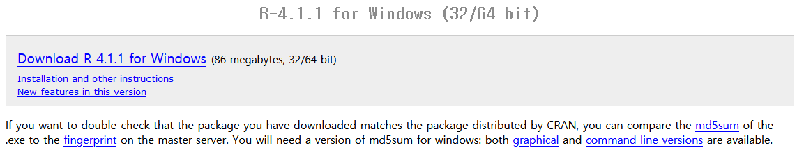

```{r setup, include=F}
knitr::opts_chunk$set(echo=T, eval=F, cache = T)
```

## Session Goal
<ol type="1">
<li> Have a functioning R installed on the system </li>
<li> Set working environment </li>
<li> Learn how to access data </li>
<li> Learn the basic R and RStudio interface </li>
</ol>

## Outline

<ol type="1">
<li>**How to install R and RStudio**</li>
<li>**How to install R packages**</li>
<li>**How to set the working directory**</li>
<li>**How to load and save data in R**</li>
<li>**Operator Precedence in R**</li>
<li>**How to name an object in R**</li>
<li>**How to make comments in R**</li>
<li>**How to run a line or lines in R**</li>
<li>**Basic RStudio interface**</li>
</ol>

Update this outline
update: Example
read.csv


## How to install R and RStudio | Download and Install R
- [`Download R`](https://mirror.las.iastate.edu/CRAN/)
- [`Download RStudio`](https://www.rstudio.com/products/rstudio/download/)


<!-- <br> -->

<!-- <div align="center"> -->
<!--    -->
<!--    -->
<!--    -->
<!-- </div> -->

## How to install R packages | CRAN: Comprehensive R Archive Network
<ol type="1">
<li> Install using RStudio </li>
<ol type="i">
<li> Select <micode class="highlighter-rouge">Packages</micode> tab in the lower-right pane of RStudio</li>
<li> Click the <micode class="highlighter-rouge">Install</micode> tab </li>
<p style="text-align:center;"></p> <!--style="height:5%">-->
<li> Enter the name of the package(s) </li>
<p style="text-align:center;"></p>
</ol>
</ol>

## How to install R packages | CRAN: Comprehensive R Archive Network
<ol type="1" start="2">
<li> Install using R script </li>
<ol type="i">
<li> Use `install.packages` function to install </li>

```{r}
install.packages("dplyr") # Example: Install the 'dplyr' pkg
```

<li> Install multiple packages </li>

```{r}
install.packages(
  c("readxl", "ggplot2", "dplyr") # Install multiple pkgs
)
```

</ol>
</ol>

## How to install R packages | GitHub

<ol type="1">
<li> Install the [`devtools`](https://github.com/r-lib/devtools) package </li>


```{r}
install.packages("devtools")
```

<li> Use the `devtools::install_github("author/package")` </li>

```{r}
devtools::install_github("")

# Bioconductor
```
</ol>

## How to install R packages | Load R packages
<ol type="1">
<li> Use RStudio </li>
<p style="text-align:center;"></p> <!--style="height:5%">-->
<li> Use R script </li>
```{r}
library(dplyr) # Returns an error if the requested pkg not found
require(dplyr) # Returns FALSE if the requested pkg not found

pkg <- c("readxl", "ggplot2", "dplyr") # Load multiple pkgs
sapply(pkg, require, character.only = TRUE)
```
</ol>

## How to install R packages | Your Turn!
Please install the following packages:<br>
<br>
- [`ggplot2`](https://cran.r-project.org/web/packages/ggplot2/ggplot2.pdf): System for declaratively creating graphics <br>
- [`dplyr`](https://cran.r-project.org/web/packages/dplyr/dplyr.pdf): Package for working with data frame <br>
- [`readxl`](https://cran.r-project.org/web/packages/readxl/readxl.pdf): Package for importing excel files into R <br>
- [`rvest`](https://cran.r-project.org/web/packages/rvest/rvest.pdf): Package for scrape data from web pages <br>
- [`tidyr`](https://cran.r-project.org/web/packages/tidyr/tidyr.pdf): Package for create tidy data <br>
- [`lubridate`](https://cran.r-project.org/web/packages/lubridate/lubridate.pdf): Package for handling dates/times <br>
- [`purrr`](https://cloud.r-project.org/web/packages/purrr/purrr.pdf): Package for functional programming toolkit for R <br>
- [`data.table`](https://cran.r-project.org/web/packages/data.table/data.table.pdf): Package for data manipulation <br>
<!-- <span class="tab1"></span> -->
<br>
<p class="pnote"><b>Note</b>: The above packages (excluding `data.table`) are part of the [`tidyverse`](https://cran.r-project.org/web/packages/tidyverse/tidyverse.pdf) package</p>


## How to set the working directory

`Working directory`: <br> 
A  path that sets the default location of any files <br> you read into or write out of R
<br>
<br>
<ol type="1">
<li> Check your current working directory </li>
```{r eval=T, comment=""}
getwd() # My working directory for constructing this presentation slide
```

<p style="text-align:center;"></p>

</ol>

## How to set the working directory
<ol type="1" start="2">
<li> Set your working directory </li>
<ol type="i">
<li> Script: Run the following script </li>
```{r}
# Replace PATH_place_holder with a directory address 
setwd("PATH_place_holder")
```
<li> Script: Run the following script </li>
```{r}
# The following code will enable you to navigate through directories
setwd(choose.dir())
```
</ol>
</ol>


## Navigating Files and Directories
<ol type="1" start="1">
<li> `./`</li>
Current directory <br>
```{r warning=F, eval=T, comment=""}
setwd("./") # Directory where this slide was generated
getwd()
```

<li> `/`</li>
Root directory <br>
```{r warning=F, eval=T, comment=""}
setwd("/")
getwd()
```
</ol>

## Navigating Files and Directories
<ol type="1" start="3">
<li> `~/`</li>
Home directory <br>
```{r warning=F, eval=T, comment=""}
setwd("~/")
getwd()
```
<li> `../`</li>
Move to the parent directory
```{r warning=F, eval=T, comment=""}
setwd("~/../") # Note: You can start anywhere
getwd()        # Does not have to start from "~/"
```
</ol>

## Navigating Files and Directories
<ol type="1" start="5">

<li> `/` or `\\` </li>
Directory separator
```{r warning=F, eval=T, comment=""}
setwd("~/../Desktop") # Note: You can start anywhere
setwd("~\\..\\Desktop") # `\` requires 'escape' -> \\
getwd()
```


<li>Full Path</li>
```{r warning=F, eval=T, comment=""}
setwd("C:/Users/Tek/Desktop/RWorkshop")
setwd("C:\\Users\\Tek\\Desktop\\RWorkshop") 
getwd()
```
</ol>


## How to set the working directory
<ol type="1" start="2">
<li> Set your working directory </li>
<ol type="i" start="3">
<li> RStudio Interface</li>
<p style="text-align:center;"></p>
<p style="text-align:center;"></p>
</ol>
</ol>

## How to set the working directory | (Optional) How to create and modify directories in R
<ol type="3">
<li> How to create and directories R </li>
<li> How to delete/rename directories in R </li>
<li> How to list directories and files in R </li>
```{r}
list.dirs()
list.files()
```

</ol>


## How to read and write data in R | CSV extension
<ol type="1">
<li> Reading csv file: </li>
<ol type="i">
<li> [`read.csv()`](https://www.rdocumentation.org/packages/utils/versions/3.6.2/topics/read.table) </li>
Basic syntax
```{r}
# Basic syntax
read.csv(file,                 # Path and file name
         header = TRUE,        # Whether to read the header or not
         sep = ",",            # Delimiter
         quote = "\"",         # Quoting character
         dec = ".",            # Decimal point
         fill = TRUE,          # Whether to fill blacks or not
         encoding = "unknown", # Encoding of the file
         ...)                  # Additional arguments
```

</ol>
</ol>
<p class="pnote">
NOTE: Function `read.csv()` is a wrapper of `read.table()` <br>
NOTE: Read [Arguments for read.csv()](https://www.rdocumentation.org/packages/utils/versions/3.6.2/topics/read.table) for additional information 
</p>

## How to read and write data in R | CSV extension
<ol type="1">
<li> Reading csv file: </li>
<ol type="i">
<li> [`read.csv()`](https://www.rdocumentation.org/packages/utils/versions/3.6.2/topics/read.table) </li>
Example
```{r}
# Example

# Read csv file name "csv_example" from cwd and name it df
df<-read.csv("data/csv_example.csv")
# read.csv("data/semicol.csv", header = F, sep = ";")

# `file` could be a complete URL
read.csv("url.csv")
```
</ol>
</ol>

## How to read and write data in R | CSV extension
<ol type="1">
<li> Reading csv file: </li>
<ol type="i" start="2">
<li>[`read_csv()`](https://readr.tidyverse.org/reference/read_delim.html)</li>
<li>[`fread()`](https://www.rdocumentation.org/packages/data.table/versions/1.14.0/topics/fread)</li>
```{r}
# package_name::function_name(...)

readr::read_csv(...)
data.table::fread(...)
```
</ol>
</ol>
<p class="pnote"> NOTE: Each package/function may have different arguments and output type </p>

## How to read and write data in R | CSV extension
<ol type="1" start="2">
<li> Writing csv file: </li>
<ol type="i">
<li> `write.csv()` </li>
```{r}
# Basic Syntax
write.csv(x,                    # Object to be exported
          file,                 # Path and File name
          row.names = TRUE,     # Whether to include row names or not
          ...)                  # Additional arguments
```

Example
```{r}
# Example: save df as csv file with name "write_csv"
write.csv(df, "data/write_csv.csv", row.names = F)
```
</ol>
</ol>

## How to read and write data in R | XLSX extension
xlsx format needs a separate library 
readxl (part of the tidyverse package)

<ol type="1">
<li> Reading xlsx file: </li>
<ol type="i">
<li> `read`.xlsx()` </li>

```{r}
readxl::read_excel()
# reading individual sheets
```

```{r}
openxlsx
```

People using mac

```{r}
# Basic Syntax
write.csv(x,                    # Data frame to be exported
          file,                 # Full path
          sheetName = "Sheet1", # Name of the sheet
          col.names = TRUE,     # Whether to include column names or not
          row.names = TRUE,     # Whether to include row names or not
          append = FALSE,       # Whether to append to an existing file
          showNA = TRUE,        # If TRUE, NA are empty cells
          password = NULL)      # Password as string
```

</ol>
</ol>

## How to read and write data in R binary format | .rds and .Rdata(rda)
(fast and space efficient)

<ol type="1">

```{r}
readRDS()
saveRDS()

load()
save()
```
</ol>


## How to load and save in R | text (Lines)
```{r}
readLines()
```

```{r}

```

## How to load and save in R | json file
```{r}
install.packages("rjson")
library(rjson)
fromJSON(collapse="")
# jsonlite
```


## Operator Syntax and Precedence | Assignment
<ol type="1">
<li>Assignment operators</li>
```{r eval=F}
# Assign into the environment in which they are evaluated
# Compare with <<-
<-    # Can be used anywhere
=     #
  
<<-   # Usually used in functions. Assignment takes place in the global environment
  

g=function(){
  x<-"saved inside a function";
  # print(environment())
  # print(ls())
}
f=function(){
  x<<-"saved to the global environment"
  # print(environment())
  # print(ls())
}
  
```

<li> Assignment (left to right) </li>

```{r eval=F}
->
->>
```


```{r eval=F}
# Basic Syntax

# x: a variable name. 
# value: a value to be assigned to `x`
x<-value
x=value
x<<-value
  
# x Can be quoted using the back-quote symbol ``
# Example
`name with space`<-value
```
</ol>

## Naming Convensions in R
<ol type="1">
<li>Things Not-To-Do</li>
<ol type="i">
<li>Avoid using period `.` in a name</li>

```{r eval=T, comment=""}
# You can do it but...
.<-1
.+.
```

```{r eval=T, comment=""}
# Also avoid having "." within a name
# You can do it but...
na.me<-"this is a name"
na.me
```

<li>Avoid using space in a names</li>

```{r}
# Avoid having " " within a name
# You can do it but...
`space here`<-"there is a space"
```

<li>Avoid using special keywords or names already occupied</li>
</ol>

## Operator Syntax and Precedence | Mathematical Operators

<ol type="1">
<li>Mathematical Operators</li>
```{r eval=F}
# +, - , *, /

^ or **        # Exponentiation
x %% y         # Modulus
x %/% y        # Integer Division

+=
-=

```
</ol>

## Operator Syntax and Precedence | Logical Operators

<ol type="1">
<li>Logical Operators</li>
```{r eval=F}
# <, <=, >, >=

==             # Exactly equal to. cf) %in%
!=             # Not equal to 
!x             # Not x
x | y          # x or y
x & y          # x and y

x %in% y       # What is in x that is also in y
```

```{r}
a=c(1,2,3)
b=c(3,4,5)
(a ==3) & (b == 5)
```


```{r}
# What is in x but not in y
! x %in% y
```

</ol>

## Operator Syntax and Precedence | Precedence
<ol type="1">
```{r eval=F, size=1}
# The operators listed in precedence groups, from highest to lowest.

:: :::            # access variables in a namespace
$ @               # component / slot extraction
[ [[              # indexing
^ **              # exponentiation (right to left)
- +               # unary minus and plus
:                 # sequence operator
%any% |>          # special operators (including %% and %/%)
* /               # multiply, divide
+ -               # (binary) add, subtract
< > <= >= == !=   # ordering and comparison
!                 # negation
& &&              # and
| ||              # or
~                 # as in formulae
-> ->>            # rightwards assignment
<- <<-            # assignment (right to left)
=                 # assignment (right to left)
```
</ol>


## Operator Syntax and Precedence | Your Turn!
```{r}
T|F&T
100 + 200 / 10 - 3 * 10
201 %/% 10 /5
# a = 10; b = 20; c = 30
# c > b > a
```

## Useful Hot Keys
<ol type="1">
<li>how to make comments in R</li>
Writing comments to your code is very important
<li>How to run a line or lines in R</li>


## R Markdown
Why do we use it?


<!-- ##### -->
<ol type="1">
<li></li>
</ol>

```{r}
# n=10^4
# start_time <- Sys.time()
# vec = NULL;
# for (i in seq_len(n)){
#   vec = c(vec, i)
# }
# Sys.time() - start_time
# 
# start_time <- Sys.time()
# vec = numeric(n);
# for (i in seq_len(n)){
#   vec[i] = i
# }
# Sys.time() - start_time
```

