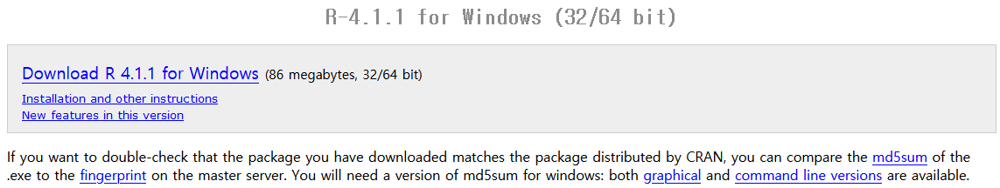

```{r setup, include=F}
knitr::opts_chunk$set(echo=T, eval=F, cache = T)
```

## Session Outline

<ol type="1">
<li>**How to install R and RStudio**</li>
<li>**How to install R packages**</li>
<li>**How to set the working directory**</li>
<li>**How to load and save data in R**</li>
<li>**Operator Precedence in R**</li>
<li>**How to name an object in R**</li>
<li>**How to make comments in R**</li>
<li>**How to run a line or lines in R**</li>
<li>**Basic RStudio interface**</li>
</ol>

Update this outline
update: Example
read.csv


## How to install R and RStudio | Download and Install R
- [`Download R`](https://mirror.las.iastate.edu/CRAN/)
- [`Download RStudio`](https://www.rstudio.com/products/rstudio/download/)
<!-- <br> -->

<!-- <div align="center"> -->
<!--    -->
<!--    -->
<!--    -->
<!-- </div> -->

## RStudio Interface | Panes
<p style="text-align:center;"></p>


## How to install R packages | CRAN: Comprehensive R Archive Network
<ol type="1">
<li> Install using RStudio </li>
<ol type="i">
<li> Select <micode class="highlighter-rouge">Packages</micode> tab in the lower-right pane of RStudio</li>
<li> Click the <micode class="highlighter-rouge">Install</micode> tab </li>
<p style="text-align:center;"></p> <!--style="height:5%">-->
<li> Enter the name of the package(s) </li>
<p style="text-align:center;"></p>
</ol>
</ol>

## How to install R packages | CRAN: Comprehensive R Archive Network
<ol type="1" start="2">
<li> Install using R script </li>
<ol type="i">
<li> Use `install.packages` function to install </li>

```{r}
install.packages("dplyr") # Example: Install the 'dplyr' pkg
```

<li> Install multiple packages </li>

```{r}
install.packages(
  c("readxl", "ggplot2", "dplyr") # Install multiple pkgs
)
```

</ol>
</ol>

## How to install R packages | GitHub
<ol type="1">
<li> Install the [`devtools`](https://github.com/r-lib/devtools) package </li>

```{r eval=F}
install.packages("devtools")
```

<li> Use `devtools::install_github("username/repository")` </li>

```{r eval=F}
devtools::install_github("RWorkshop-at-UF/pkg_example")
```

<p class="pbd">username: `RWorkshop-at-UF`<br>repository: `pkg_example`<br>package name: `welcome`<br>function: `GreetingsFrom`</p>
<br>
<p class="pnote"><a href="https://github.com/RWorkshop-at-UF/pkg_example">GitHub Repository for my example</a></p>
<br>
<br>
<p class="pnote"><b>Note</b>: There are other repositories for R packages. e.g. <a href="https://www.bioconductor.org/install/">Bioconductor</a></p>
</ol>


## How to install R packages | Load R packages
<ol type="1">
<li> Use RStudio </li>
<p style="text-align:center;"></p> <!--style="height:5%">-->
</ol>

## How to install R packages | Load R packages
<ol type="1" start="2">
<li> Use R script </li>
```{r}
library(welcome) # Returns an error if the requested pkg not found
require(welcome) # Returns FALSE if the requested pkg not found
```

<li>Load multiple pkgs using R script</li>
```{r eval=T, comment="", message=F, warning=F}
pkg <- c("readxl", "ggplot2", "dplyr") 
sapply(pkg, require, character.only = TRUE)
# You may see warnings and messages in red text
```
</ol>


## Calling a function from an R Package
<ol type="1">
<li>Call a function after loading the package</li>
```{r eval=T, comment=""}
library(welcome)
GreetingsFrom("Tek")
```

<li>Call a function from the package directly </li>
```{r eval=T, comment=""}
welcome::GreetingsFrom("Tek")
```
</ol>


## How to remove R package 
<ol>
Removing an R package

```{r eval=F}
remove.packages("welcome")
# You can remove multiple packages
# remove.packages(c("pkg1", "pkg2",...))
```
</ol>


## Your Turn! | Please install the following packages:
- [`ggplot2`](https://cran.r-project.org/web/packages/ggplot2/ggplot2.pdf): System for declaratively creating graphics <br>
- [`dplyr`](https://cran.r-project.org/web/packages/dplyr/dplyr.pdf): Package for working with data frame <br>
- [`readxl`](https://cran.r-project.org/web/packages/readxl/readxl.pdf): Package for importing excel files into R <br>
- [`rvest`](https://cran.r-project.org/web/packages/rvest/rvest.pdf): Package for scrape data from web pages <br>
- [`tidyr`](https://cran.r-project.org/web/packages/tidyr/tidyr.pdf): Package for create tidy data <br>
- [`lubridate`](https://cran.r-project.org/web/packages/lubridate/lubridate.pdf): Package for handling dates/times <br>
- [`purrr`](https://cloud.r-project.org/web/packages/purrr/purrr.pdf): Package for functional programming toolkit for R <br>
- [`jsonlite`](https://cran.r-project.org/web/packages/jsonlite/jsonlite.pdf): A Simple JSON Parser and Generator for R <br>
- [`data.table`](https://cran.r-project.org/web/packages/data.table/data.table.pdf): Package for data manipulation <br>
<!-- <span class="tab1"></span> -->
<br>
<p class="pnote">Check if all packages are successfully installed</p>
<p class="pnote"><b>Note</b>: The above packages (excluding `jsonlite` and `data.table`) are part of the [`tidyverse`](https://cran.r-project.org/web/packages/tidyverse/tidyverse.pdf) package</p>


## Structure of directories
<p style="text-align:center;"></p>
<a href="https://rafalab.github.io/dsbook/unix.html"><p class="pnote" style="text-align:right">image_source</p></a>
<li>A file is in a directory</li>
<li>A directory consists of files and directories</li>
<br>
Let's learn how to navigate through directories

## Navigating Directories and Files | Notation
<ol  type="1" start="1">
<li>`/` Root directory, i.e., root of the tree</li>
<li>`~` Short cut for user's home directory</li>
<li>`.` Current directory</li>
<li>`..` Parent directory of the current directory</li>
</ol>

## Navigating Directories and Files
<ol type="1" start="1">
<li> `/`</li>
Root directory <br>
```{r warning=F, eval=T, comment=""}
setwd("/")
getwd()
```
<li> `~`</li>
Home directory <br>
```{r warning=F, eval=T, comment=""}
setwd("~")
getwd()
```
</ol>

## Navigating Directories and Files
<ol type="1" start="3">
<li> `.`</li>
Current directory <br>
```{r warning=F, eval=T, comment=""}
setwd(".") # Directory where this slide was generated
getwd()
```

<li> `..`</li>
Move to the parent directory
```{r warning=F, eval=T, comment=""}
setwd("./..")  # Note: You can start anywhere
getwd()        # Does not have to start from "~/" or "./"
```
</ol>

## Navigating Directories and Files
<ol type="1" start="5">

<li> `/` or `\\` </li>
Sub-directory
```{r warning=F, eval=T, comment=""}
# You can use the Full Path
setwd("C:/Users/Tek/Desktop/RWorkshop")     # Note: You can start anywhere
setwd("C:\\Users\\Tek\\Desktop\\RWorkshop") # `\` requires 'escape' -> \\
getwd()
```

</ol>

## How to set a working directory
`Working directory`: <br> 
A  path that sets the default location of any files <br> you read into or write out of R
<br>
<br>
<ol type="1">
<li> Check your current working directory </li>
```{r eval=T, comment=""}
getwd() # My working directory for constructing this presentation slide
```

<p style="text-align:center;"></p>

</ol>

## How to set a working directory
<ol type="1" start="2">
<li> Set your working directory </li>
<ol type="i">
<li> Script: Run the following script </li>
```{r}
# Replace PATH_place_holder with a directory address 
setwd("PATH_place_holder")
```
<li> Script: Run the following script </li>
```{r}
# The following code will enable you to navigate through directories
setwd(choose.dir())
```
</ol>
</ol>

## How to set a working directory
<ol type="1" start="2">
<li> Set your working directory </li>
<ol type="i" start="3">
<li> RStudio Interface</li>
<p style="text-align:center;"></p>
<p style="text-align:center;"></p>
</ol>
</ol>

## Create/modify directories and files in R | List directories and files
<ol type="i">
<li> List directories in a directory</li>
```{r}
list.dirs()
```

<li> List files in a directory</li>
```{r}
dir()
# list.files()
```

<li> List files with specific pattern</li>

```{r}
list.files(pattern=".*\\.html")  # list any file with .html extension
dir(pattern=".*\\.html")         # list any file with .html extension
```

```{r echo=F, eval=T, comment=""}
dir(pattern=".*\\.html") 
```


<p class="pnote"><b>Note</b>: <a href="https://www.rdocumentation.org/packages/base/versions/3.6.2/topics/list.files">Additional Arguments</a></p>
</ol>

## Create/modify directories and files in R | Create directory and file
<ol type="i">
Use functions `dir.create` and `file.create`
```{r}
dir.create("new_directory_name")
# The above code may generate a warning if the directory already exists
# dir.create("new_directory_name", showWarnings=F)
file.create("some_file_with_extension")
```


```{r}
# Example
dir.create("new_dir")
file.create("new_dir/new_text_file.txt")
```

## Create/modify directories and files in R | Delete directory and file
<ol>
use function `unlink`
```{r}
unlink("some_file_with_extension")
unlink("some_directory", recursive = T)
```

```{r}
# Example
unlink("new_dir", recursive = T)
```
<p class="pnote"><b>Note</b>: <a href="https://theautomatic.net/2018/07/11/manipulate-files-r/">Additional Readings</a></p>
</ol>


## How to read and write data in R | CSV extension
<ol type="1">
<li> Reading csv file: </li>
<ol type="i">
<li> [`read.csv()`](https://www.rdocumentation.org/packages/utils/versions/3.6.2/topics/read.table) </li>
Basic syntax
```{r}
# Basic syntax
read.csv(file,                 # Path and file name
         header = TRUE,        # Whether to read the header or not
         sep = ",",            # Delimiter
         quote = "\"",         # Quoting character
         dec = ".",            # Decimal point
         fill = TRUE,          # Whether to fill blacks or not
         encoding = "unknown", # Encoding of the file
         ...)                  # Additional arguments
```

</ol>
</ol>
<p class="pnote">
<b>NOTE</b>: Function `read.csv()` is a wrapper of `read.table()` <br>
<b>NOTE</b>: Read [Arguments for read.csv()](https://www.rdocumentation.org/packages/utils/versions/3.6.2/topics/read.table) for additional information 
</p>

## How to read and write data in R | CSV extension
<ol type="1">
<li> Reading csv file: </li>
<ol type="i">
<li> [`read.csv()`](https://www.rdocumentation.org/packages/utils/versions/3.6.2/topics/read.table) </li>

```{r}
# Example

# Read csv file name "csv_example" from cwd and name it df
df<-read.csv("data/csv_example.csv")
# read.csv("data/semicol.csv", header = F, sep = ";")

# `file` could be a complete URL
x="https://raw.githubusercontent.com/nytimes/covid-19-data/master/us.csv"
read.csv(x)
```
</ol>
</ol>

## How to read and write data in R | CSV extension
<ol type="1">
<li> Reading csv file: </li>
<ol type="i" start="2">
<li>[`read_csv()`](https://readr.tidyverse.org/reference/read_delim.html)</li>
<li>[`fread()`](https://www.rdocumentation.org/packages/data.table/versions/1.14.0/topics/fread)</li>
```{r}
# package_name::function_name(...)
readr::read_csv(...)
data.table::fread(...)
```
</ol>
</ol>
<p class="pnote"><b>NOTE</b>: Each package/function may have different arguments and output type </p>

## How to read and write data in R | CSV extension
<ol type="1" start="2">
<li> Writing csv file: </li>
<ol type="i">
<li> `write.csv()` </li>
```{r}
# Basic Syntax
write.csv(x,                    # Object to be exported
          file,                 # Path and File name
          row.names = TRUE,     # Whether to include row names or not
          ...)                  # Additional arguments
```

Example
```{r}
# Example: save df as csv file with name "new_csv"
write.csv(df, "data/new_csv.csv", row.names = F)
```
</ol>
</ol>

## How to read and write data in R | XLSX extension
xlsx format needs a separate library

<ol>
<li><a href="https://cran.r-project.org/web/packages/readxl/readxl.pdf">`readxl`</a></li>
<li><a href="https://cran.r-project.org/web/packages/xlsx/xlsx.pdf">`xlsx`</a></li>
<li><a href="https://cran.r-project.org/web/packages/openxlsx/openxlsx.pdf">`openxlsx`</a></li>
```{r}
readxl::read_excel()
xlsx::read.xlsx()
openxlsx::read.xlsx()
```

```{r}
# Example
readxl::read_excel("data/xlsx_example.xlsx", 2)
```
</ol>

<p class="pnote"><b>NOTE</b>: `readxl` is part of the `tidyverse` package </p>

## How to read and write data in R | XLSX extension

<ol>
```{r}
writexl::write_excel()
openxlsx::write.xlsx()
xlsx::write.xlsx()
```

```{r}
# Example
x=list(sheet_one=mtcars, sheet_two=iris)
openxlsx::write.xlsx(x, "data/new_xlsx.xlsx")
```
</ol>

## How to read/write in R binary format| .rds and .Rdata(rda) Extension
Binary formats are fast and space efficient
<ol>
```{r}
readRDS(path)
saveRDS(x, path)
```

```{r}
# Example: saveRDS
thermo <- read.csv("data/thermostat_amazon.csv")
saveRDS(thermo, "data/thermostat_amazon.rds")
```

```{r}
# Example: readRDS
thermo_rds<-readRDS("data/thermostat_amazon.rds")
```
</ol>

## How to read/write in R binary format| .rds and .Rdata(rda) Extension
<ol>
```{r comment=""}
# Check the size difference
file.size("data/thermostat_amazon.csv")/10^6
file.size("data/thermostat_amazon.rds")/10^6
```

```{r echo=F, eval=T, comment=""}
# Check the size difference
cat(c("csv: ", file.size("data/thermostat_amazon.csv")/10^6, "MB\n","rds: ", 
file.size("data/thermostat_amazon.rds")/10^6, "MB"))
```
</ol>
<p class="pnote"><b>NOTE</b>: Please read <a href="https://www.rdocumentation.org/packages/base/versions/3.6.2/topics/load">`load`</a> and <a href="https://www.rdocumentation.org/packages/base/versions/3.6.2/topics/save">`save`</a> for Rdata format</p>


## How to load and save in R | Read-in Lines
<ol>
```{r}
readLines(path)
writeLines(x, path)
```

```{r}
# Example
readLines("data/text_file_example.txt")  # Not restricted to txt format
readLines("session1_master.Rmd")
```

```{r}
# Example
x=c("first line", "second line", "third line")
writeLines(x, "data/new_txt.txt")
```
</ol>


## How to load and save in R | .json file Extension

<ol>
<li>Read .json</li>
```{r}
# Example
jsonlite::fromJSON("data/json_example.json")
jsonlite::fromJSON("https://api.fda.gov/drug/event.json?limit=3")
# check the structure
```

<p class="pnote">Link to the <a href="https://open.fda.gov/">openFDA</a> and <a href="https://api.fda.gov/drug/event.json?limit=3">example data</a> above</p>

```{r echo=F}
readLines("https://api.fda.gov/drug/event.json?limit=3" , n = 12) %>%
  cat()
```

<li>Write .json</li>
```{r}
# Example
nested_list<-list(vec=c(1,2), mat=list(mat1=diag(2), mat2=matrix(0,3,4)))
now_json<-jsonlite::toJSON(nested_list, pretty=T)
write(now_json, "data/new_json.json")
```
</ol>
<p class="pnote"><b>NOTE</b>: <a href="https://www.w3schools.com/js/js_json_syntax.asp"> JSON syntax </a></p>
<p class="pnote">Please check <a href="https://cran.r-project.org/web/packages/jsonlite/jsonlite.pdf">`jsonlite`</a>,  <a href="https://cran.r-project.org/web/packages/rjson/rjson.pdf">`rjson`</a>, and <a href="https://cran.r-project.org/web/packages/RJSONIO/RJSONIO.pdf">`JRSONIO`</a> packages</p>

## Operator Syntax and Precedence | Assignment Operators
<ol type="1">
<p style="font-size:18px">Assign object name into the environment in which they are evaluated</p>
```{r eval=F}
# Basic Right to left Assignment Syntax

# x: a variable name. 
# value: a value to be assigned to `x`
x<-value
x=value
x<<-value # Usually used inside a function. 
          # Assignment takes place in the global environment
# Left to right assignment -> and ->> works similarly
```
<p class="pnote"><a href="https://cran.r-project.org/doc/manuals/r-release/R-lang.html#Operators">List of base R operators</a></p>
</ol>

## Operator Syntax and Precedence | Assignment Operators
<ol>
Comparison between `<-` and `<<-`<br>
```{r}
# Example with <-
g=function(){
  not_saved <-"saved inside a function envvironment";
}
g()
```

```{r}
# Example with <<-
f=function(){
  saved<<-"saved to the global environment"
}
f()
```
</ol>
<p style="font-size:18px">Check the Environment pane after running each code chunk</p>
```{r echo=F}
# Check the Environment pane after running each function
g=function(){
  not_saved<-"saved inside a function";
  # print(environment())
  # print(ls())
}
```

```{r echo=F}
f=function(){
  saved<<-"saved to the global environment"
  # print(environment())
  # print(ls())
}
```


## Operator Syntax and Precedence | Assignment Operators - Naming Conventions in R
<ol type="1">
<li>Things To-Do</li>
<ol type="i">
<li>Remove spaces between words</li>
```{r}
# You can do it but...
`space here`<-"there is a space"
```

Alternatively...
<ul>
<li>snake_case</li>
<li>camelCase/PascalCase</li>
</ul>
<li>Keep it short(er) and consistent</li>
<li>Try to make it meaningful (avoid generic names)</li>
</ol>

## Operator Syntax and Precedence | Assignment Operators - Naming Conventions in R

<ol type="1" start="2">
<li>Things Not-To-Do</li>
<ol type="i">
<li>Avoid using special keywords or names already occupied</li>
Example
<ul>
<li>c</li>
<li>next</li>
<li>save</li>
<li>T or F</li>
</ul>
</ol>
</ol>

## Operator Syntax and Precedence | Assignment Operators - Naming Conventions in R
<ol type="1" start="2">
<li>Things Not-To-Do</li>
<ol type="i" start="2">
<li>Avoid using period `.` in a name</li>
<!-- <p style="font-size:18px"> -->
```{r eval=T, comment=""}
# You can do it but...
.<-1
.+.
```

```{r eval=T, comment=""}
# Also avoid having "." within a name
# You can do it but...
na.me<-"This type of naming may have a special meaning"
na.me
```

<!-- identifier and preceding qualifier, separation of methods and classes in S3, to hide internal functions -->

</ol>
</ol>

## Operator Syntax and Precedence | Mathematical Operators

<ol type="1">
```{r eval=F}
# The four basic operators +, - , *, /

^ or **        # Exponentiation
x %% y         # Modulus           (returns remainder of a division)
x %/% y        # Integer Division

%*%            # Matrix Multiplication
%o%            # Outer product
%x%            # Kronecker product
```
</ol>

## Operator Syntax and Precedence | Logical Operators
<ol type="1">
```{r eval=F}
# inequalities <, <=, >, >=

==             # Exactly equal to.
x %in% y       # What is in x that is also in y (exact match)
x != y         # x not equal to y 
!x             # Not x (can be used to negate TRUE to FALSE or vice versa)
x | y          # x or y (vectorized)
x || y         # x or y (not vectorized)
x & y          # x and y (vectorized)
x && y         # x and y (not vectorized)
# Check the difference between | vs. || and & vs. &&
```
</ol>

## Operator Syntax and Precedence | Logical Operators
Examples
<ol>
```{r}
x<-10; x>10; x>=10
```

```{r}
0==F; 1==T
T+T
```

```{r}
a="apple"; b="banana"
a == b; a != b; !(a != b)

fruits <- c("apple", "banana", "mango")
fruits == "apple"; "apple" == fruits
fruits == c("apple", "banana")       # This will not work. Use `%in%` instead of `==`
# x %in% y   What is in x that is also in y
fruits %in% c("apple", "banana"); c("apple", "banana") %in% fruits
# How to code "what is in x but not in y
```
</ol>


## Operator Syntax and Precedence | Logical Operators
Examples
<ol>
```{r}
T|T; T|F; F|F             # `|` is the "or" operator
c(T, T, F) | c(T, F, F)
```

```{r}
T&T; T&F; F&F             # `&` is the "and" operator
c(T, T, F) & c(T, F, F)
```

```{r}
x<-5
x >= 3 & x < 6
y=c(1, 3, 5, 7)
y >= 3 & y < 6
y >= 3 && y < 6     
y <= 3 | y > 6
y <= 3 || y > 6
```
</ol>
<p class="pnote"><a href=""?</a></p>

## Operator Syntax and Precedence | Precedence - highest to lowest
<ol type="1">
```{r eval=F, size=1}
:: :::            # access variables in a namespace
$ @               # component / slot extraction
[ [[              # indexing
^ **              # exponentiation (right to left)
- +               # unary minus and plus
:                 # sequence operator
%any% |>          # special operators (including %% and %/%)
* /               # multiply, divide
+ -               # (binary) add, subtract
< > <= >= == !=   # ordering and comparison
!                 # negation
& &&              # and
| ||              # or
~                 # as in formulae
-> ->> <- <<-     # assignment
=                 # assignment (right to left)
```
</ol>


## Your Turn! | Operator Syntax and Precedence

<p style="font-size:20px">Predict the output of the following code chunks</P>
<ol>
```{r}
100 + 200 / 10 - 3 * 10
```

```{r}
201 %/% 10 / 5    # Note: %/% is an integer division
```

```{r}
!F|T&c(T, F)
```

```{r}
a=5
c=(b=a+2)-(a=a-1)
```

```{r}
! c(TRUE, F, FALSE, 1)
```

```{r}
x<-1:5
! x < 3
```
</ol>


## Useful Hot Keys (RStudio)
<ol type="1">
<li>Make comments in R</li>
<ul>
<li>Adding # in front a line makes it into a comment</li>
<li>Hot key: ctrl+shift+c</li>
</ul>
<li>How to run a line or lines in R</li>
<ol type="i">
<li>Pleace the cursor or highlight the lines</li>
<li>ctrl+enter</li>
</ol>
<li>Clear the Console - ctrl+l</li>
<li>Move focus to the Source Editor - ctrl+1</li>
<li>Move focus to the Console - ctrl+2</li>
<li>Interrupt R - Esc </li>
</ol>