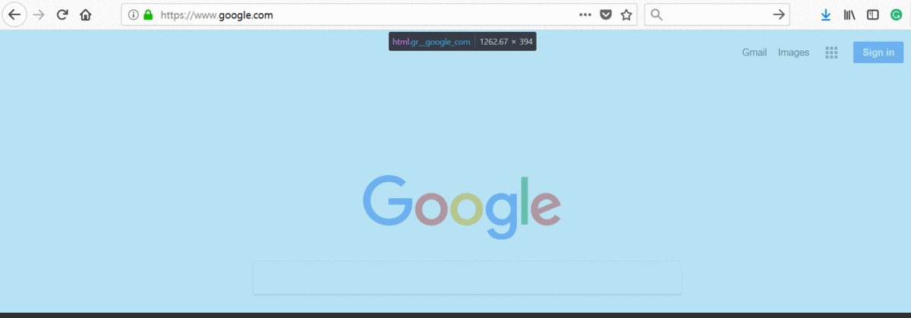
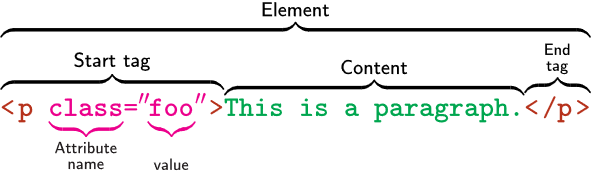
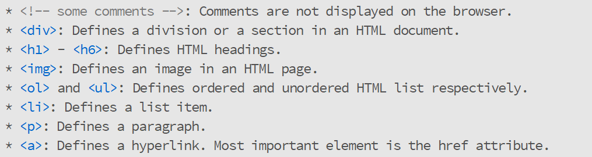

```{r setup, include=F}
knitr::opts_chunk$set(echo=T)
```

## Outline

<ol type="1">
<li>**Web Scraping**</li>

- What is Web Scraping?<br>
- Web Scraping with `R`
- Scraping JavaScript

<li>~~**Natural Language Processing**~~</li>

- ~~POS Tagging~~
- ~~SyntaxNet~~
- ~~Other Packages~~

<li>**Regular Expression**</li>
<li>**Twitter API**</li>
</ol>

<!-- ## Web Scraping | What is Web Scraping? {.smaller}

<p> Web Scraping is data scraping used for extracting data from websites.</p>
<p>...the term typically refers to automated processes implemented using a bot or web crawler.</p>
[- Wikipedia](https://en.wikipedia.org/wiki/Web_scraping)
-->

## Web Scraping | What is HTML?

- Hypertext Markup Language (HTML)
- Standard markup language for constructing web pages
- Document Object Model (DOM)
- HTML Element
- [Example](https://www.w3schools.com/)
- See also [`CSS`](https://www.w3schools.com/css/default.asp) and [`JavaScript`](https://www.w3schools.com/js/default.asp)

## Web Scraping | Tree Structure of HTML - DOM {.smaller .columns-2}
<div align="left">

</div>

```{r eval=F}
<!DOCTYPE html>
<HTML>
    <HEAD>
        <TITLE>My Title</TITLE> 
    </HEAD>
    <BODY>
        <H1>A Heading</H1>
        <a href="some link here">Link text</a>
    </BODY>
</HTML> 
```


## Web Scraping | Tree Structure of HTML - Example {.smaller}
<div style="margin-top:-30px;"></div>
<div align="center">


</div>

## Web Scraping | HTML Element
<div style="margin-top:-30px;"></div>
<div align="center">

<br>
<br>
<div align="left">
[List of Common HTML Tags](https://www.w3schools.com/tags/tag_comment.asp)

</div>
</div>


## Web Scraping | Path selector {.smaller}
<div class="row">
<div class="column" align="left">

</div>
<div class="column" align="left">
<ul>
<li> Path selector </li>
<ul>
<li> [`xpath`](https://www.w3schools.com/xml/xpath_intro.asp)</li>
<li> [`css`](https://www.w3schools.com/css/default.asp) </li>
</ul>
<li> Finding the path </li>
<ul>
<li> Browser -> Inspect Element </li>
<li> [`Selector Gadget`](https://selectorgadget.com/) </li>
<li> [`firebug`](https://getfirebug.com/) </li>
</ul>
</ul>
</div>
</div>

## Web Scraping | More discussion on xpath {.smaller}
<div class="row">
<div class="column" align="left">

</div>
<div class="column" align="left">
Tag as an `xpath` syntax
<br>
<br>
`//p [@class="foo"]`
</div>
</div>
<br>
<div class="row">
<div class="column" align="left">
```{r eval=F, echo=T}
<!DOCTYPE html>
<html>
<body>
<h2>Another Example</h2>
<ul type="square">
  <li>Scrape Me One</li>
</ul>
<ol type="i">
  <li>Scrape Me Too</li>
</ol>
</body>
</html>
```
</div>
<div class="column" align="left">
What is the `xpath` to `Scrape Me One` content? <br>
Is `//li` enough?
</div>
</div>


## Web Scraping | Web Scraping with `R`

List of `R` packages for Web Scraping

<ul>
<li> [`rvest`](https://cran.r-project.org/web/packages/rvest/rvest.pdf)</li>
<li> [`curl`](https://cran.r-project.org/web/packages/curl/curl.pdf)</li>
<li> [`RCurl`](https://cran.r-project.org/web/packages/RCurl/RCurl.pdf)</li>
<li> [`xml2`](https://cran.r-project.org/web/packages/xml2/xml2.pdf)</li>
<li> [`httr`](https://cran.r-project.org/web/packages/httr/httr.pdf)</li>
</ul>

## Web Scraping | rvest {.smaller}
<div style="margin-top:-30px;"></div>
<ol type="1">
<li> Load `rvest` </li>
```{r eval=F, echo=T}
#install.packages("rvest")
library(rvest)
```
<li> `read_html()`</li>
Create an html document from a URL, a string, or a file containing html
<br>
```{r eval=F, echo=T}
read_html("some url")
```
<li> `html_nodes()`</li>
Two important arguments
<ul>
<li> Either a document or a node (set)</li>
<li> Path in `xpath` or `css` </li>
</ul>
```{r eval=F, echo=T}
html_nodes(document, css=path)
html_nodes(document, xpath=path)
```
</ol>

## Web Scraping | `rvest` (Cont.) {.smaller}
<div class="row">
<div class="column" align="left">
<ol start="4">
<li>Extract Components</li>
<ul>
<li> `html_text()`</li>
Extract all text inside the tag
<li> `html_attr()`</li>
Extract contents of a single attribute
<li> `html_attrs()`</li>
Extract all attributes
<li> `html_table()`</li>
Parse tables into data frames
<li> `html_name()`</li>
Extract the name(s) of the tag(s)
</ul>
</ol>
</div>
<div class="column" align="left">
<ol start="5">
<li> Combine the steps </li>
</ol>
See also [`%>%`](https://cran.r-project.org/web/packages/magrittr/magrittr.pdf)
```{r eval=F, echo=T}
"some url" %>%
  read_html() %>%
  html_nodes(xpath="some path") %>%
  html_`component`()
```
</div>
</div>


## Web Scraping | Example {.smaller}
<div style="margin-top:-30px;"></div>
Scrape the first paragraph of the definition of web scraping from <br> [https://en.wikipedia.org/wiki/Web_scraping](https://en.wikipedia.org/wiki/Web_scraping)
<br>
<br>

Things to consider
<br>
<ul>
<li> URL </li>
<li> Element </li>
<li> Path</li>

<!--
</div>
<br>
<div class="row">
<div class="column" align="left">

</div>
<div class="column" align="left">
Things to consider
<br>
<br>
<ul>
<li> URL </li>
<li> Element </li>
<li> Path</li>
</ul>
</div> 
</div>
-->

## Web Scraping | Example Solution{.smaller}
```{r warning=F, echo=F, eval=T, message=F}
library(rvest)
library(dplyr)
library(DT)
```

```{r eval=F, echo=T}
"https://en.wikipedia.org/wiki/Web_scraping" %>%
  read_html() %>%
  html_nodes(xpath="//body//div//div//div//div//p") %>%
  .[1] %>%
  html_text()
```


<!--
<div class="row" style="margin-top:-30px;"></div>
```{r message=F, comment=""}
# H3 Header
"http://stat.yonsei.ac.kr/stat/intro/greetings.do" %>%
  read_html() %>%
  html_nodes(xpath='//h3') %>%
  html_text()

# p tag
"http://stat.yonsei.ac.kr/stat/intro/greetings.do" %>%
  read_html() %>%
  html_nodes(xpath='//p [@class="con-p"]')->temp
temp[1] %>% html_text()
```

```{r eval=F, echo=T}
"http://stat.yonsei.ac.kr/stat/intro/greetings.do" %>%
  read_html() %>%
  html_nodes(xpath='//p [@class="con-p"]') %>%
  html_text() %>%
  .[1]
```
-->

## Web Scraping | Advanced Example {.smaller}
<div class="row" style="margin-top:-30px;">
<div class="column" align="left">
<a href="http://stat.yonsei.ac.kr/stat/faculty/f_current.do">

</a>
</div>
<div class="column" align="left">
Scrape the following information of each professor:
<br>
<ul>
<li> Name </li>
<li> Research Interest </li>
<li> Email Address</li>
<li> Info Link</li>
</ul>
</div> 
</div>

## Web Scraping | Advanced Example {.smaller}
<ol>
<li>`xpath` of the smallest container that includes all tags</li>
`//div [@class="board-faculty-box"]`
<li>`xpath` of each tags</li>
<ul>
<li> Name </li>
`.//dl//dt`
<li> Research Interest </li>
`.//dd//span`
<li> Email Address</li>
`.//dd//a[not(contains(@title, 'more information'))]`
<li> Info Link</li>
`.//dd//a [@title="more information"]`
</ul>
<li> Put tags into a vector </li>
<li> Run a loop for each element in the vector</li>
</ol>

## Web Scraping | Advanced Example - Step 1 {.smaller}

```{r echo=T, comment=""}
# xpath of the min container
min_con='//div [@class="board-faculty-box"]'

"http://stat.yonsei.ac.kr/stat/faculty/f_current.do" %>%
  read_html() %>%
  html_nodes(xpath=min_con)->temp
temp
```

## Web Scraping | Advanced Example - Step 2  {.smaller}
<div class="row" style="margin-top:-50px;"></div>
```{r echo=T, eval=F}
sub_path=c(
  name=".//dl//dt",
  research=".//dd//span",
  email=".//dd//a[not(contains(@title, 'more information'))]"
)

lapply(sub_path, function(x) html_nodes(temp, xpath=x)%>% html_text()) %>%
  as.data.frame(stringsAsFactors=F)
```

```{r echo=F, eval=T}
sub_path=c(
  name=".//dl//dt",
  research=".//dd//span",
  email=".//dd//a[not(contains(@title, 'more information'))]"
)

lapply(sub_path, function(x) html_nodes(temp, xpath=x)%>% html_text()) %>%
  as.data.frame(stringsAsFactors=F)->temp2
temp2%>%
  DT::datatable()
```

## Web Scraping | Advanced Example - Step 3  {.smaller}
<div class="row" style="margin-top:-50px;"></div>
```{r echo=T, eval=T, comment=""}
link='.//dd//a [@title="more information"]'
html_nodes(temp, xpath=link) %>%
  html_attr(name="href") %>%
  head(3)
```

```{r echo=F, eval=T}
link='.//dd//a [@title="more information"]'
html_nodes(temp, xpath=link) %>%
  html_attr(name="href") %>%
  cbind(temp2,link=.) %>%
  DT::datatable()
```


## Web Scraping | Scraping JavaScript

**Why is this a problem?**<br>
Web sites that employ JavaScript-rendering load their page content with a delay

**How can we go about solving this problem?**
<ol>
<li> Headless Browser</li>
<li> Browser Automation</li>
</ol>

## Web Scraping | [`Headless Browser`](https://en.wikipedia.org/wiki/Headless_browser) {.smaller}
<div style="margin-top:-30px;"></div>
<ol>
<li> Download [PhantomJS](http://phantomjs.org/download.html)</li>
<li> Extract `phantomjs.exe` into your working directory</li>
<li> Save the following script with `.js` extension </li>
e.g. `p_browser.js`
```{r eval=F}
var url ='URL GOES HERE';
var page = new WebPage()
var fs = require('fs');

page.open(url, function (status) {
        just_wait();
});

function just_wait() {
    setTimeout(function() {
               fs.write('new.html', page.content, 'w');
            phantom.exit();
    }, 2500);
}

```
</ol>

## Web Scraping | `Headless Browser`(Cont.) {.smaller}
<ol start="4">
<li> Update `js` script with a target URL</li>
```{r eval=F, echo=T}
url="Define your URL"
lines <- readLines("p_browser.js")
lines[1] <- paste0("var url ='", url ,"';")
writeLines(lines, "p_browser.js")
```

<li> Run the headless browser</li>
```{r eval=F, echo=T}
system("phantomjs p_browser.js")
```

<li> Use `rvest` to parse html</li>
```{r eval=F, echo=T}
"new.html" %>%
  read_html() %>%
  ...
```
</ol>

## Web Scraping | Headless browser Example {.smaller}
<div class="row" style="margin-top:-50px;"></div>
Goal: Scrape the [table](http://64px.com/instagram/)

Attempt with `rvest` only

```{r eval=F, echo=T}
"http://64px.com/instagram/" %>%
  read_html() %>%
  html_table(fill=T)
```

```{r eval=T, echo=F, comment=""}
"http://64px.com/instagram/" %>%
  read_html() %>%
  html_table(fill=T)->fail
fail[[1]]
# fail[[2]]
```

## Web Scraping | Headless browser Example (Cont.) {.smaller}
<div class="row" style="margin-top:-50px;"></div>
Using `PhantomJS` and `rvest` together

```{r eval=F, echo=T, comment=""}
url="http://64px.com/instagram/"
lines <- readLines("p_browser.js")
lines[1] <- paste0("var url ='", url ,"';")
writeLines(lines, "p_browser.js")
system("phantomjs p_browser.js")

"new.html" %>%
  read_html() %>%
  html_table(fill=T)
```

```{r eval=T, echo=F, comment=""}
url="http://64px.com/instagram/"
lines <- readLines("p_browser.js")
lines[1] <- paste0("var url ='", url ,"';")
writeLines(lines, "p_browser.js")
system("phantomjs p_browser.js")

"new.html" %>%
  read_html() %>%
  html_table(fill=T) %>%
  .[[2]] -> suc
colnames(suc)<-c("Rank",	"Username",	"Followers Yesterday",	"Followers Today",	"Followers Lost",	"Percent Lost")
suc<-suc[-1, ]  
suc$Rank<-as.numeric(suc$Rank)
suc %>%
  DT::datatable()
```

Download image files?
```{r eval=F, echo=T}
?download.file
```


## Web Scraping | Browser Automation {.smaller}

[`Selenium`](https://github.com/SeleniumHQ/selenium) automates browser!

Setup
<ol>
<li> [`Python`](https://www.python.org/getit/)</li>
<li> [`chromedriver`](https://sites.google.com/a/chromium.org/chromedriver/downloads) or [`geckodriver`](https://github.com/mozilla/geckodriver/releases) </li>
Do not forget to set a **PATH**
<li> Install required libraries </li>
```{r echo=T, eval=F}
import pip
from pip._internal import main
main(['install', 'selenium'])
main(['install', 'bs4'])
# main(['install', 'lxml'])
```
</ol>

## Web Scraping | Browser Automation (Cont.) {.smaller}

How to browse websites using `Selenium`

<ol>
<li> Load web driver</li>
```{r echo=T, eval=F}
from selenium import webdriver
```

<li> Set web driver</li>
```{r echo=T, eval=F}
browser = webdriver.Firefox()
browser = webdriver.PhantomJS("Path to your PhantomJS")
browser = webdriver.Chrome("Path to your chromedriver")

# driver.implicitly_wait(3)
```

<li> Navigate to URL </li>
```{r echo=T, eval=F}
browser.get('url goes here')
```
</ol>

## Web Scraping | Browser Automation (Cont.) {.smaller}

How to find elements using `Selenium`

```{r echo=T, eval=F}
browser.find_element_by_xpath('path')
browser.find_element_by_id('path')
browser.find_element_by_css_selector('path')
browser.find_element_by_name('path')
browser.find_element_by_class_name('path')
browser.find_element_by_tag_name('path')
browser.find_element_by_link_text('path')
browser.find_element_by_partial_link_text('path')

# Or Simply
from selenium.webdriver.common.by import By

browser.find_elements(By.XPATH, '//button')
```

Use find_element**s**_ for multiple elements


## Web Scraping | Example

```{r echo=T, eval=F}
from selenium import webdriver
browser = webdriver.Firefox()
url='https://www.google.com'
browser.get(url)
browser.find_element_by_name('q').send_keys('What is Life?')
browser.find_element_by_name('btnK').click()
```

## Web Scraping | `Selenium` and `BeautifulSoup`

[`BeautifulSoup`](https://www.crummy.com/software/BeautifulSoup/) is an HTML parser

```{r echo=T, eval=F}
from bs4 import BeautifulSoup

browser.get('http://stat.yonsei.ac.kr/stat/index.do')
html = driver.page_source
soup = BeautifulSoup(html, 'html.parser')
tag_list = soup.select('div.gnb > ul.gnb-ul > li > ul.sub-mn > li > a')
for n in tag_list:
    print(n.text.strip())
```

```{r echo=T, eval=F}
"http://stat.yonsei.ac.kr/stat/index.do" %>%
read_html()%>%
  html_nodes(css='div.gnb > ul.gnb-ul > li > ul.sub-mn > li > a')
```


<!--## Web Scraping | Tips for Webscraping

<ul>
<li>TryCatch</li>
```{r echo=T, eval=F}
tryCatch(fun, warning=function(w){}, error=function(e){})
?tryCatch
```

<li>Allow your computer to take time</li>
```{r echo=T, eval=F}
Sys.sleep(5)
?Sys.sleep
```

</ul>
-->


<!--
## Natural Language Processing (NLP) {.smaller}

**What is NLP?**<br>
<p> ... interactions between computers and human (natural) languages, in particular how to program computers to process and analyze large amounts of natural language data. </p>
[- Wikipedia](https://en.wikipedia.org/wiki/Web_scraping)
<br>
<br>
**Part-of-speech (POS) tagging**<br>
<p> the process of marking up a word in a text (corpus) as corresponding to a particular part of speech,[1] based on both its definition and its context</p>
[- Wikipedia](https://en.wikipedia.org/wiki/Web_scraping)

## NLP | Confirmatory Aspect-based Opinion Mining Processes

Algorithm -- `DiSSBUS`

**1. Disintegrating**<br>
Compress each clause to a bi-term with negation
words if applicable.
```{r echo=T, eval=F}
strsplit(string, pattern, perl=T)
```

```{r echo=T, eval=F, comment=""}
"Im so sorry but I love you ?? ??????" # feat. ????
strsplit("I??m so sorry but I love you ?? ??????", "but|(?<=.)(?=??)", perl=T)[[1]]
```

## NLP | Algorithm -- `DiSSBUS`

**2. Summarizing**<br>
Summarize each clause to a bi-term with negation
words if applicable.
<br>
<br>
cleaning First!
<ul>
<li>Stopwords</li>
<li>Stemming</li>
<li>n-gram</li>
```{r echo=T, eval=F}
?twimws
```
</ul>

## NLP | Algorithm -- `DiSSBUS`

**3. Straining**<br>
Extract specific bi-terms
that are classified as a common expression
```{r echo=T, eval=F}
library(dplyr)
?group_by
?mutate
?n
?filter
```
## NLP | Algorithm -- `DiSSBUS`
**4. Bagging**<br>
Match the selected bi-terms to a pre-specified topic.
<br>
<br>
<br>
**5. Upcycling**<br>
Topics are selectively assigned on unstrained bi-terms according to the matching results of the strained bi-terms.
[Thesaurus](https://www.thesaurus.com/)

<br>**6. Scoring**<br>
```{r echo=T, eval=F}
install.packages("tidytext")
```
[`Hedonometer`](https://en.wikipedia.org/wiki/Hedonometer)

-->

## Regular Expression  {.smaller}

What is `Regex`?
<p> A `string` is a set of characters and `Regex` is a pattern that describes a set of strings </p>
<br>
<ol type="1">
<li>Character Classes and Operators</li>
<li>Metacharacters and Escape</li>
<li>Quantifiers</li>
<li>Anchors</li>
<li>Functions for Pattern Matching</li>
</ol>


## Regular Expression | Character Classes {.smaller}
<div style="margin-top:-30px;"></div>
<!--POSIX character classes are expressed in double brackets `[[]]`.-->
<ol>
<li>Digits</li>
- `[[:digit:]]` or `\\d` or `[0-9]`
- Hexadecimal digits: `[[:xdigit:]]` or `\\x` or `[0-9A-Fa-f]`
- Note: non-digits can be written as `[^0-9]` or `\\D`

<li>Alphabetic Characters</li>
- `[[:alpha:]]` or `[A-z]`
- Upper-case letters: `[[:upper:]]` or `[A-Z]`
- Lower-case letters: `[[:lower:]]` or `[a-z]`
- Checkout `toupper` and `tolower` functions.

<li>Alphanumeric Characters (1 and 2 combined)</li>
- `[[:alnum:]]` or `[A-z0-9]`
- Word characters, i.e., `[A-z0-9_]` can simply be written as `\\w` and non-word char as `\\W`
</ol>

## Regular Expression | Character Classes (Cont.) {.smaller}

<ol start="4">
<li>Punctuation</li>
- `[[:punct:]]`

<li>Space</li>

- `[[:space:]]` or `\\s`
- Note: Non-space characters can be written as `\\S`

<li>Control characters</li>
- `[[:cntrl:]]` or `\\c`
- Note: Non-control characters can be written as `\\C`
</ol>

## Regular Expression | Character Groups and Operators {.smaller}

<ol start="7">
<li>`.`</li>
Any character except `\n`

<li>`|`</li>
Math equivalent of "or". <br>
e.g. (a|b) is 'a' or 'b'

<li>`[...]`</li>
"..." is the list of characters permitted in the pattern.<br>
One can specify a list of characters to EXCLUDE by doing `[^...]`. <br>
A range of characters can be specified by using `-`. Example, `[A-Z]`. <br>

<li>`(...)`</li>
Grouping may be used for back referencing using `\\N` where 'N' is an integer.

</ol>

## Regular Expression | Metacharacters and Escape {.smaller}

Metacharacters: A set of characters that have special meaning to a computer program.

- `\n`: New line
- `\t`: Tab
- `\v`: Vertical tab
- `\r`: Carriage return
- `\f`: Form feed

To escape metaccharacter means to make the metaccharacter ineffective. The usual way to escape metacharacter is to add backslash symbol(`\`). <br>
e.g. `\\n`, `\\.`, `\\+`

```{r eval=F, echo=F}
cat("a\nb")
cat("a\\nb")
gsub(".", "", "Hi.")
gsub("\\.", "", "Hi.")
```


## Regular Expression | Quantifiers {.smaller}

Quantifiers specify the number of repetitions of a pattern.

- `*`: Matches at least 0 times
- `+`: Matches at least 1 times
- `?`: Matches at most 1 times
- `{n}`: Matches exactly n times
- `{n,m}`: Matches between n and m times
- `{n,}`: Matches at least n times
- `{,m}`: Matches at most m times


## Regular Expression | Anchors {.smaller}

Position of a pattern within the string can be identified using an anchor expression.

- `^`: Start of the string
- `$`: End of the string
- `\\<`: Beginning of the word
- `\\>`: End of the word
- `\\b`: Empty string at either edge of a word. Note: `\\B` means NOT the edge of a word

## Regular Expression | Functions for Pattern Matching {.smaller}
<div style="margin-top:-30px;"></div>
<ol>
<li>Detect Pattern</li>
- `grep(pattern, string, value)`: The location of the pattern is given as a numerical vector. When `value=T`, the output is in character string(s).
- `grepl(pattern, string`: The output is given as a logical vector format.

<li>Replace Pattern</li>
- `gsub(pattern, replacement, string)`: replace all matches. Note that `sub` only replaces the first match.

<li>Split a String</li>
- `strsplit(string, pattern)`: Splits a string into multiple string vectors using a pattern. <br>
Good to know [lookarounds](https://www.regular-expressions.info/lookaround.html) and [conditionals](https://regular-expressions.info/conditionals.html).

<li>Concatenating string vectors</li>
- `paste0(character_vectors)`
- `paste(character_vectors, sep, collapse)`
</ol>

## Regular Expression | Functions for Pattern Matching (Cont.) {.smaller}

<ol start="5">
<li>Others</li>
- Locate Pattern: `regexpr(pattern, string)` and `gregexpr(pattern, string)`
- Extract Patterns: `regmatches` in combination with `regexpr`. <br>
&nbsp &nbsp e.g. `regmatches(string, gregexpr(pattern, string))`
- `perl-like regex`
- Check `stringr` and `ngram` packages.
- Removing non-ASCII characters and encoding (especially utf-8 encoding).
</ol>

## Regular Expression | Your Turn! {.smaller}
<div style="margin-top:-30px;"></div>
<ol>
<li>Erase all tabs and new lines. Also, split the string into two sentences.</li>
```{r eval=F}
string="Text\tdata\twith\tjunk.\nDeal\twith\tit."
```

<li>Correct the typo</li>
```{r eval=F}
string2="I don't know how to write Misissssssippi"
```

<li>List all US states with two s.</li>
Note: object `state.name` is a character vector of all US state names.

<li>Impossible?</li>
```{r eval=F}
c("I", "m", "possible")
```

<li>Your numeric score up to now. What's the score out of? Do not use the raw number</li>
```{r eval=F}
string3="G8 job. I give you 12 out of 10 for your work."
```
</ol>


## Regular Expression | Solution! {.smaller}
<div style="margin-top:-30px;"></div>

```{r eval=F}
# Q1
gsub("\\t|\\n", " ", string)
# Q1-1
strsplit(gsub("\\t|\\n", " ", string), "\\.")
# Q2
gsub("s+", "ss", string2)
# Q3
grep("ss", state.name, value=T)
# Q4
paste0("I", "m", "possible") #or
paste0(c("I", "m", "possible"), collapse="")
# Q5
gsub(".*([0-9]{2}).*", "\\1", string3)
# Q5-1
gsub(".*?([0-9]{2}).*", "\\1", string3)
```

## Twitter API | Setup {.smaller}

1. Create a Twitter developer account.
[https://developer.twitter.com/en.html](https://developer.twitter.com/en.html)

2. Keys and Tokens
- Consumer Key
- Consumer Secret Key
- Access Token
- Access Token Secret

## Twitter API | R - `TwitteR` {.smaller}

<ol>
<li>Install `twitteR` package</li>
```{r echo=T, eval=F}
library(twitteR)
```

<li>Setup Twitter OAuth</li>

```{r echo=T, eval=F}
setup_twitter_oauth(consumer_key="Consumer Key", consumer_secret = "Consumer Secret Key",
                    access_token="Access Token",access_secret="Access Token Secret")
```

```{r echo=F, eval=F, message=F}
ACCESS_TOKEN= "819746317404672001-Hfx4q70tdEkccGwJhaqN6UKDwi7uo27"
ACCESS_SECRET="6lgM2wT1Mca0dDDoWLLVwh6PTrdDBSlkzlHHKUTj6LpRG"
CONSUMER_KEY="izMB07L5fVq3wB5fr1J3pCMKg"
CONSUMER_SECRET="vQhQxtjkYc7xE0WMHePbAzPauPlZahb7N9lWgMLUtMlSHV2hg7"
setup_twitter_oauth(consumer_key=CONSUMER_KEY, consumer_secret = CONSUMER_SECRET, access_token=ACCESS_TOKEN,access_secret=ACCESS_SECRET)
```


<li>Useful Functions</li>
```{r echo=T, eval=F}
searchTwitter(string, n)
# e.g. searchTwitter("#UF", n=10)
# e.g. searchTwitter("@BarackObama", n=10, resultType="recent")
# e.g. searchTwitter("from:realDonaldTrump", n=10, resultType="recent")->tw
strip_retweets()
# e.g. strip_retweets(tw)
```
</ol>

## Twitter API | Python - `twitter` library {.smaller}

Another example using a Python library the `twitter`.<br>
The output will be on `JSON` format, so further extraction/cleaning is required.

```{r echo=T, eval=F}
import json
from twitter import Twitter, OAuth, TwitterHTTPError, TwitterStream

CONSUMER_KEY="Your Consumer Key"
CONSUMER_SECRET="Your Consumer Secret Key"
ACCESS_TOKEN= "Your Token"
ACCESS_SECRET="Your Secret Token"

oauth=OAuth(ACCESS_TOKEN, ACCESS_SECRET, CONSUMER_KEY, CONSUMER_SECRET)

twitter=Twitter(auth=oauth)
twitter.search.tweets(q='from:realDonaldTrump', count=10)
```

