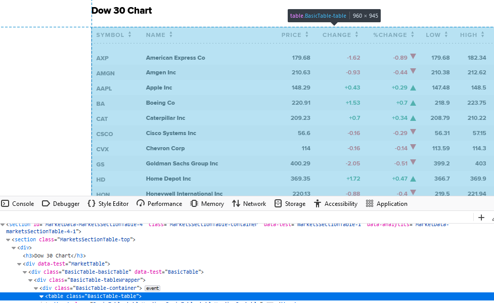

```{r setup, include=F}
knitr::opts_chunk$set(echo=T, eval=F, cache = F)
```


## Session outline

```{r eval=T, include=F}
library(dplyr)
library(rvest)
```
<ol>
<li>Part 1 Recap</li>
<ul>
<li>How to select paths<br>
 - Understand HTML structure and elements
<li>How to use `rvest` package</li>
</ul>
<li>Part 2: R Selenium</li>
<ul>
<li>Selenium automates browsers<br>
 - primarily for testing purposes but...</li>
<li>To Scrap JavaScript enable pages</li>
<li>Top selenium Commands</li>
</ul>
</ol>

## JavaScript enable pages | Example : <a href="/session7/html_example.html">class example</a>
<p>
Try to scrape the current time
<br>
<br>

</p>

## JavaScript enable pages | Example : <a href="https://www.cnbc.com/dow-30/">CNBC Dow 30</a>
<p>
Try to scrape the Dow 30 Chart
<br>
<br>

</p>

## R Selenium | Setup

<ol>
<li>Installation</li>
```{r}
install.packages("RSelenium")
library(RSelenium)
```
<li>Check Chrome Version</li>
Open `Chrome` >> `Menu` >> `help` >> `About Google Chrome`<br>

</ol>

## R Selenium | Setup
<ol start="3">
<li>Start a selenium server and browser: <a href="https://www.rdocumentation.org/packages/RSelenium/versions/1.7.7/topics/rsDriver">rsDriver()</a> function</li>
```{r}
# Check your chrome version!
driver <- rsDriver(browser = "chrome", chromever =  "95.0.4638.69")
```
If successful, a new chrome browser will launch<br>
<p style="font-size:20px">`Chrome is being controlled by automated test software`</p>
<br>

</ol>

## R Selenium | Setup

<ol start="4">
<li>Open and close Client</li>
```{r}
driver$client$open()
driver$client$close()
rm(driver) # remove from the environment
```
<li>Free port(s)</li>
```{r}
# If ∃ Error "Selenium server signals port = #### is already in use"
# Free all the ports (windows)
system("taskkill /im java.exe /f", intern=FALSE, ignore.stdout=FALSE)
# Free a specific port

# Get process identifier (PID)
shell("netstat -aon | find \"<Port ####>\"")   # replace <Port ####>
# Kill PID
system("Taskkill /F /T /PID <PID>")            # replace <PID>
```
</ol>

## R Selenium | Basic Navigation
<ul>
<li>`navigate()` function</li>
```{r}
driver$client$navigate("https://www.cnbc.com/dow-30/")
```
<li>`goBack()` and `goForward()` functions</li>
```{r}
driver$client$goBack()
driver$client$goForward()
driver$client$getCurrentUrl()  # Check the current urls
```
<li>`getPageSource()` function</li>
```{r}
driver$client$getPageSource()[[1]] %>%
  rvest::read_html() %>%
  rvest::html_nodes(xpath='//table [@class="BasicTable-table"]') %>%
  rvest::html_table()
```

</ul>

## R Selenium | Sending Events to Elements -- Click

<ol>
<li>Use `findElement()`function and `xpath`</li>
<p class="pnote"><b>NOTE</b>: You can search by `name`, `ID`, `class`, `CSS`.</p>
```{r}
find_AXP_Elm = 
  driver$client$findElement(using="xpath",'//a [contains(text(), "AXP")]')
```
<li>Use `clickElement()` function to click element</li>
```{r}
find_AXP_Elm$clickElement()
```
</ol>
<br>
<br>

## R Selenium | Sending Events to Elements -- Sending Text and Key Press
<ol>
<li>`webElement$sendKeysToElement()` function</li>
```{r}
driver$client$navigate("https://www.google.com")
driver$client$findElement(
  using = "xpath",'//* [@name="q"]')$sendKeysToElement(list("UF"))
# ... sendKeysToElement(list(" Marketing", key="enter")) # Press enter Key
```

<li>Backspace</li>
```{r}
$findElement(using = "xpath",'//* [@name="q"]')$sendKeysToElement(list("\b"))
# Or ... $sendKeysToElement(list(key="backspace"))
```

<li>`ClearElement()` function</li>

```{r}
$findElement(using = "xpath",'//* [@name="q"]')$clearElement()
```
</ol>
<p class="pnote">Check `selKeys`</p>

```{r echo=F}
driver$client$findElement(using = "xpath",'//i [@class="icon-search"]')$clickElement()
driver$client$findElement(using = "xpath", "//input [@id = 'query']")$sendKeysToElement(list("AXP", key="enter"))
# driver$client$findElement(using = "xpath", "//input [@id = 'query']")$sendKeysToElement(list("\b")) # backspace
driver$client$findElement(using = "xpath",'//button [@type="submit"]')$clickElement()

```


## R Selenium | Sending Events to Elements -- Scroll
<ol>
<li>Send Key Press</li>
```{r}
driver$client$navigate("https://www.reddit.com/search/?q=emptiness")
driver$client$findElement(using = "css", "body")$sendKeysToElement(
  list(key = "end")) # "home", "page_down", "down_arrow"
```

<li>Execute Javascript with `executeScript()` function</li>
```{r}
# Scroll vertically down by 10000 pixel
driver$client$findElement(using = "css", "body")$executeScript(
  "scroll(0, 10000);")
# Scroll down to the end of the page
...$executeScript("window.scrollTo(0, document.body.scrollHeight)")
# Consider writing a loop for dynamic webpages
# Hint1: Check the scroll hight
...$executeScript("return document.body.scrollHeight")
# Hint2: Run a while loop with system sleep
```
<ol>

## R Selenium | Timeout
<ol>
<li>`Sys.sleep()`</li>
<ul><li>to pause R execution for defined time (seconds)</li></ul>
<li>implicit</li>
<ul><li><p>to set a wait time before searching and locating a web element</p></li></ul>
```{r}
driver$client$setTimeout(type="implicit", milliseconds=1000)
```
<li>page load</li>
<ul><li><p>to set a limit on the time that the script allots for a web page to be displayed</p></li></ul>
```{r}
driver$client$setTimeout(type="page load", milliseconds=1000)
```
</ol>

```{r echo=F}
# open windows powershell
netstat -aon | findstr 4567
taskkill /f /pid 17488

# Mac
sudo lsof -i :4567
kill -9 <PID>

# Free particular port
driver$server$process$get_pid() %>%
  system(paste0("Taskkill /F /T" ," /PID ", .))
```


```{r}
url="https://www.zillow.com/homes/Phoenix,-AZ_rb/"
```

